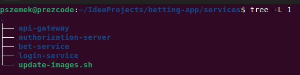

# Betting App Meta Repo

## History

Idea for the app is simple. Once upon a time, during every major football (soccer for US) event, we used to place our
bets for the winning teams. That was a time when I still worked as a civil engineer. We used a whiteboard for this and
only one game was "on the board" simultaneously. Now, when I switched my career track and became a software developer,
I decided to create an automated way for this. And so, with this repository, the third version of the same app comes to
live. Every single version is different in a way, and every one tries to use a different technology.

Version 1 (Spring Boot monolith and Vue.js):

- Backend: https://github.com/pszemek90/mtj-worldcup-standings
- Frontend: https://github.com/pszemek90/mtj-world-cup

Version 2 (Plain Java on Serverless - AWS stack, Lambda, CDK, DynamoDb. Frontend is almost the same as v1):

- Backend: https://github.com/pszemek90/mtj-worldcup-aws
- Frontend: https://github.com/pszemek90/mtj-world-cup-new

In version 3 I will try to follow microservice architecture in a way I understand it from https://microservices.io/ and
the book by Chris Richardson - Microservices Patterns. This repository will contain kubernetes yamls to run the
application
locally and possibly some helper scripts I use.

## Repositories

Most of these have sample logic so far, but fully operational.

List of microservices repositories (separate repo for every microservice to keep them as isolated as possible):

- [API Gateway](https://github.com/pszemek90/api-gateway)
- [Authorization Server](https://github.com/pszemek90/authorization-server)
- [Bet Service](https://github.com/pszemek90/bet-service)
- [Login Service](https://github.com/pszemek90/login-service)

## How to run it

All services are runnable Spring Boot apps (so far). In the future I may try to experiment with a different framework or
languages to leverage microservice architecture. Since these are Spring Boot, they can be run from and IDE (at least
from
IntelliJ) using local profile (so run it with `-Dspring.profiles.active=local`). Production version is meant to be run
on Kubernetes. I personally use Minikube, the documentation page should be enough to set it
up (https://minikube.sigs.k8s.io/docs/).
Obviously you'll need Docker or some other container runtime. Now Minikube uses a different Docker daemon than the one
that is used on your system, so in order to let your images be available for Minikube cluster (if you don't want to
push them to Docker Hub), you need to use Minikube Docker daemon for building images. To do so, you need to run the
following
command (all examples work on Ubuntu 24.04): `eval $(minikube docker-env)`
[docs](https://minikube.sigs.k8s.io/docs/handbook/pushing/#1-pushing-directly-to-the-in-cluster-docker-daemon-docker-env)
(start your Minikube cluster before with `minikube start`). To shake things up a bit, I'm also pushing newly built
images
to [local registry](https://hub.docker.com/_/registry) created in Minikube docker daemon.

Having all of this set up, you need to clone service repositories. I recommend putting them in a common folder (such as
'services') because you're gonna use a bash script to build and push images. Put the script `update-images.sh` in this
folder like so:



The script will iterate through the folders, build an image and push it to the Docker registry (the one in Minikube).
After that, go to `k8s`directory and apply config yamls with `kubectl apply -f .` (cause you've got kubectl installed,
right?). If you want to use Elasticsearch stack, you need to do the same in `k8s/elastic` directory. After all of this,
you need a way to call the API Gateway somehow, so forward the port using
`kubectl port-forward service/api-gateway 8080:80` and you'll have the gateway reachable on your localhost. So far the
only working endpoint is `/login` endpoint accepting `POST` call with the following body:

```
{
    "username": "user",
    "password": "password"
}
```

This simulates a frontend call with user credentials. Another one is `/bets/health` dummy service `GET` endpoint, that
requires access token returned from the `/login` call.

Logs are configured in ecs format (thanks to Spring Boot 3.4 structured logging), so you can inspect these in Kibana.
To do so, you need to port-forward Kibana with `kubectl port-forward service/quickstart-kb-http 5601`. Then you can go
to `https://localhost:5601` using `elastic` as the username and the result of following command as the password
`kubectl get secret quickstart-es-elastic-user -o=jsonpath'{.data.elastic}' | base64 --decode; echo`.